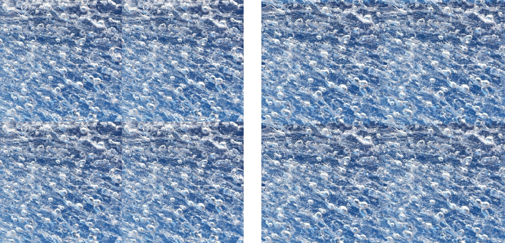
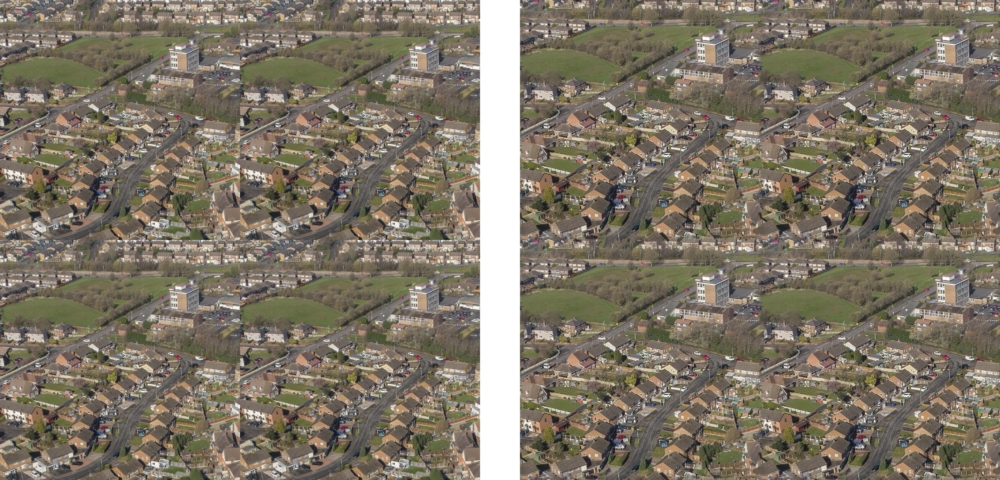
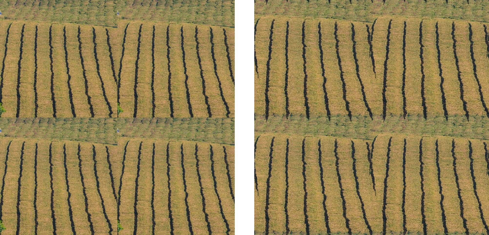

# convert-image-into-seamless-tileable-texture
Turn a texture image, such that it can be tiled seamlessly into uniform texture. Basically, change the image boundary regions to hide the stitching line in the image's native patterns.
This is taking the boundaries of the image and changing them so that opposite sides of the image will merge seamlessly, this is done by using the image topography to create stitching lines that follow the image's native patterns and as such much less conscious and harder to detect.

Figure 1)  Left stitching before modification, right tiling after modification

# setting
install opencv:
pip install opencv-python

# run on image
python convert_image.py --input_image "path_to_input_image" --output_image "where_to_save_output_image" --output_tiled_image "where_output_tiled_image_will_be_saved"
 
 
 --input_image is the path to the image you want to convert  
 --output_image is the path  to the output seamless image
 --output_tiled_image is the path to the output seamless image tiled (for visualization)
 
# run on folder
python convert_folder.py --input_dir "folder containing images to be converted" --out_dir "folder where the converted seamless images will be saved"  

# important parameters

--gap  
The size of the region on the image border that will be used for blending in percentage or pixels (default: 0.12/60). If this number is larger then one uses it as a number of pixels. If it's smaller than one use it as a fraction of the image size, the larger this will be the smoother the blending but it will also crop the image, making it smaller. 

--blurring  Size of Gaussian blur used to make merging softer and more gradual. Use odd numbers only larger numbers meaning higher blurryness. (default: 3) 

--maintain_size  default=True  maintain the image's original size, if this is true resize  the image at the end of the process to match its original size

# Alternative resources

The more traditional method for making a texture image seamless and tileable using average-based blending [https://github.com/rtmigo/img2texture](https://github.com/rtmigo/img2texture) 

# license 
Code is under cc0 but images in in_dir and display taken from the segment anything repository.

